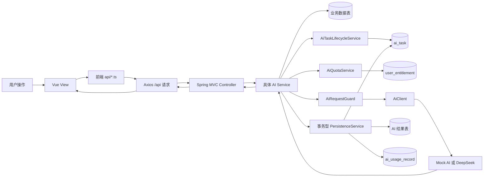

# AI 功能流程逻辑

## 1. 文档目的与范围

本文按当前仓库中的真实代码，说明平台每一项 AI 功能从浏览器发起操作，到后端校验、数据库读取、AI 供应商调用、结果与额度持久化，再返回前端展示的完整链路。

当前实际会调用 `AiClient` 的功能共有六类：

| 功能 | `AiTaskType` | 消耗权益 |
| --- | --- | --- |
| 学习资料总结 | `SUMMARY` | `AI_QUOTA` |
| 资料讲解、追问及预置模板 | `EXPLANATION` | `AI_QUOTA` |
| 考试整体 AI 分析 | `EXAM_OVERALL_ANALYSIS` | `EXAM_OVERALL_AI_QUOTA` |
| 考试个人 AI 分析 | `EXAM_PERSONAL_ANALYSIS` | `EXAM_PERSONAL_AI_QUOTA` |
| 错题 AI 分析 | `WRONG_QUESTION_ANALYSIS` | `AI_QUOTA` |
| 线下教师 AI 推荐 | `OFFLINE_TEACHER_RECOMMENDATION` | `AI_QUOTA` |

此外，本文也说明 AI 次数购买、任务与用量查询、管理员 AI 配置查看等支撑流程。

> 说明：路径均相对于项目根目录 `codes/`。前端 Axios 的默认 `baseURL` 是 `/api`，因此前端 API 文件中的 `/ai/...` 实际发送到后端时是 `/api/ai/...`。

---

## 2. AI 子系统总览

### 2.1 分层和公共组件



公共组件的职责如下：

| 层次 | 组件 | 作用 |
| --- | --- | --- |
| 前端通信 | `frontend/learning_platform_frontend/src/api/http.ts` | 注入 JWT 和 `X-Request-Id`，把后端业务异常、HTTP 异常、超时和断网统一转换为 `ApiError` |
| 前端 AI API | `frontend/learning_platform_frontend/src/api/ai.ts` | 资料总结、会话、模板、任务和用量接口；生成前端业务 `requestId`；为长时间 AI 请求设置独立超时 |
| 前端考试 API | `frontend/learning_platform_frontend/src/api/exam.ts` | 考试整体/个人分析和错题分析接口 |
| 前端教师 API | `frontend/learning_platform_frontend/src/api/offline-teaching.ts` | 保存学习偏好并请求教师推荐 |
| Web 入口 | `AiLearningController`、考试 Controller、`OfflineTeachingController` | 解析登录用户、校验请求 DTO、调用服务并封装 `ApiResponse` |
| 任务生命周期 | `backend/src/main/java/com/learningplatform/ai/service/AiTaskLifecycleService.java` | 按业务 `requestId` 创建幂等任务，维护 `PENDING → RUNNING → SUCCEEDED/FAILED` |
| 额度 | `backend/src/main/java/com/learningplatform/ai/service/AiQuotaService.java` | 检查对应权益余额；成功后用行锁和乐观锁扣减一次并写用量记录 |
| 请求保护 | `backend/src/main/java/com/learningplatform/ai/service/AiRequestGuard.java` | 按用户限制调用频率、并发数和总执行时间 |
| 供应商抽象 | `backend/src/main/java/com/learningplatform/ai/client/AiClient.java` | 业务服务只依赖统一的聊天补全接口，不直接依赖 DeepSeek 协议 |
| 真实供应商 | `backend/src/main/java/com/learningplatform/ai/client/DeepSeekAiClient.java` | 将内部消息转换为 DeepSeek Chat Completions 请求，处理认证、超时、状态码和响应标准化 |
| 模拟供应商 | `backend/src/main/java/com/learningplatform/ai/client/MockAiClient.java` | 本地开发和测试时返回可控的成功、失败或超时结果 |
| 客户端装配 | `backend/src/main/java/com/learningplatform/ai/config/AiClientConfiguration.java` | 根据 `AI_PROVIDER` 选择 Mock 或 DeepSeek，并在启动日志中输出不含密钥的有效配置 |
| 运行配置 | `backend/src/main/java/com/learningplatform/common/config/AiProperties.java`、`application.yml` | 绑定模型、地址、密钥、上下文、限流和超时配置 |

### 2.2 所有 AI 请求共有的任务与额度流程

除“创建一个空讲解会话”和只读查询外，每次生成请求都遵循以下流程：

1. 前端创建最长 64 字符的业务幂等号 `requestId`。它与 HTTP 头中的 `X-Request-Id` 不同：
   - `requestId` 写入 `ai_task.request_id`，用于防止重复调用和重复扣费；
   - `X-Request-Id` 由 Axios 拦截器生成，用于一次 HTTP 请求的日志追踪，最终以 `traceId` 返回。
2. 具体业务服务整理输入后调用 `AiTaskLifecycleService.create(...)`。
3. `AiTaskMapper.findByRequestId(...)` 先检查 `ai_task`：
   - 不存在：插入一条 `PENDING` 任务，记录用户、任务类型、资料/会话、供应商、模型、输入字符数和 `quota_cost=1`；
   - 已存在且业务目标一致：不再新建任务；
   - 已存在但用户、资料、会话或任务类型不同：返回 `40900`，禁止复用他人的幂等号。
4. 对重复请求：
   - 原任务已 `SUCCEEDED`：从对应结果表读取原结果并返回，不再调用 AI、不再扣费；
   - 原任务仍为 `PENDING/RUNNING`：返回冲突，提示正在处理；
   - 原任务为 `FAILED`：要求前端用新的 `requestId` 重试。
5. 对新任务，`AiQuotaService.requireAvailable(...)` 只做余额预检查。
6. `AiTaskLifecycleService.start(...)` 用条件更新将任务从 `PENDING` 原子地改为 `RUNNING`。
7. `AiRequestGuard.execute(...)` 执行：
   - 滑动时间窗口限流；
   - 同一用户并发信号量控制；
   - 后端统一超时控制；
   - 把 `traceId` 的 MDC 上下文传给 `ai-request-*` 工作线程。
8. `AiClient.complete(...)` 调用 Mock 或 DeepSeek。
9. 业务服务校验、解析并规范化模型输出。
10. 对应的 `*PersistenceService` 在一个数据库事务中完成：
    - 插入业务结果；
    - 锁定一条可用 `user_entitlement`；
    - 扣减一次 `available_quantity`；
    - 插入唯一业务号 `AI_TASK_{taskId}` 的 `ai_usage_record`；
    - 将 `ai_task` 从 `RUNNING` 更新为 `SUCCEEDED`。
11. 事务中任一步失败，结果、扣费记录和任务成功状态都会回滚。
12. 供应商、限流、超时、结果解析或业务处理失败时，任务改为 `FAILED`，不写 `CONSUMED` 用量记录，也不扣除次数。

任务状态机：

```text
PENDING ── start() ──> RUNNING ── 结果保存 + 扣费事务成功 ──> SUCCEEDED
   │                     │
   └──── 前置失败 ───────┴──── 调用/解析/保存失败 ─────────> FAILED
```

### 2.3 DeepSeek 调用

`DeepSeekAiClient` 当前使用非流式 Chat Completions：

1. `AiClientConfiguration` 读取 `AI_PROVIDER`：
   - `mock`：构造 `MockAiClient`；
   - `deepseek`：构造 `DeepSeekAiClient`，并要求 `DEEPSEEK_API_KEY` 非空。
2. 客户端将 `AiClientRequest` 转为供应商请求：
   - 地址：`{DEEPSEEK_BASE_URL}/chat/completions`；
   - 请求头：`Authorization: Bearer <后端环境变量中的密钥>`；
   - `stream=false`；
   - `thinking` 根据 `DEEPSEEK_THINKING_ENABLED` 设置；
   - 当业务要求 JSON 时附加 `response_format: {"type":"json_object"}`。
3. 供应商返回后，客户端校验 `choices[0].message.content` 非空，并统一返回文本、模型、供应商请求号、结束原因和 Token 统计。
4. HTTP 401/403、429、其他供应商错误、网络/读取超时分别转换为安全的 `AiClientException`，原始密钥和完整供应商响应不会写入业务错误字段。
5. 日志中的 `AI_PROVIDER_START/HEADERS/SUCCESS/FAILURE` 和同一 `traceId` 可串联一次调用。

当前默认超时关系是：

```text
供应商读取超时 620 秒
        <
后端 AiRequestGuard 总超时 630 秒
        <
资料 AI 前端超时 645 秒
```

这样供应商或后端通常能先返回明确错误，前端不会过早把它误判为普通网络超时。

---

## 3. 学习资料总结

### 3.1 入口、组件与接口

- 页面入口：
  - 学习资料详情 `ContentDetailView.vue` 的“使用 AI 学习助手”；
  - 学习界面 `LearningView.vue` 的“打开 AI 学习助手”；
  - 导航栏 `/ai-assistant`。
- 页面组件：`frontend/learning_platform_frontend/src/views/AiAssistantView.vue`
- 前端 API：`generateSummary()`、`getLatestSummary()`，位于 `src/api/ai.ts`
- 后端接口：
  - `POST /api/ai/contents/{contentId}/summaries`
  - `GET /api/ai/contents/{contentId}/summaries/latest`
- 后端入口：`backend/src/main/java/com/learningplatform/ai/web/AiLearningController.java`
- 核心服务：`AiSummaryService`
- 文本提取：`ContentTextExtractor`
- 事务保存：`AiResultPersistenceService.saveSummary(...)`

生成请求示例：

```json
{
  "requestId": "summary-5ef72f60d7254d35a31cf04b93cc3fb4"
}
```

### 3.2 前端到后端

1. `AiAssistantView.loadInitial()` 并行加载：
   - 用户可访问的学习资料；
   - `/api/entitlements/balances` 中的 AI 余额；
   - `/api/ai/usage-records` 中的历史用量。
2. 选中资料后，`loadContentAiData()` 先调用 `GET .../summaries/latest`：
   - 有历史总结就直接显示；
   - 返回 404 代表尚未生成，页面保持空状态。
3. 用户点击“生成总结”：
   - 前端先检查本地 `balances.aiQuota`；
   - 设置 `summaryLoading=true`；
   - 先显示“请求已提交”，700 毫秒后显示“AI 正在生成总结”，20 秒后提示仍在等待；
   - `createAiRequestId('summary')` 生成幂等号；
   - `generateSummary(...)` 发出长超时 POST 请求。
4. Axios 自动附加 JWT 与链路 `X-Request-Id`。

### 3.3 后端读取业务数据

1. `AiLearningController.generateSummary(...)` 解析登录用户，并判断是否具有系统管理员角色。
2. `AiSummaryService.generate(...)` 调用 `ContentTextExtractor.extract(...)`。
3. `ContentTextExtractor` 首先调用 `ContentAccessService.requireAccess(...)`，统一检查：
   - 资料是否存在、是否已发布；
   - 用户是否为发布者/管理员；
   - 公开免费、公开付费权益或班级成员访问权。
4. 权限通过后，从数据库读取：
   - `learning_content`：标题、简介、Markdown 正文；
   - `content_file`：资料下已上传文件的元数据。
5. 对 `CONTENT` 或 `ATTACHMENT` 角色的 `.txt`、`.md` 文件：
   - 单文件不超过 2 MiB；
   - 通过 `MinioStorageService` 从 MinIO 下载；
   - 仅接受合法 UTF-8 文本。
6. 文本按“资料标题、资料简介、图文正文、文本文件”分段拼接。超过 `AI_MAX_INPUT_CHARS` 时在调用 AI 前返回明确错误。
7. 对最终文本计算 SHA-256，作为 `sourceVersion`，便于判断报告对应的资料版本。

### 3.4 AI 调用与数据库回程

1. 创建 `SUMMARY` 类型的 `ai_task`。
2. 检查通用 `AI_QUOTA` 并将任务置为 `RUNNING`。
3. `AiSummaryService` 发送两条消息：
   - system：要求只依据资料，以规定 JSON 结构返回总结、知识点和复习提纲；
   - user：完整的已提取资料文本。
4. 请求参数为最多 1200 输出 Token、温度 0.2、`JSON_OBJECT` 响应格式。
5. AI 返回后，服务提取 JSON 并校验三个业务字段，将知识点数组序列化为 JSON。
6. `AiResultPersistenceService.saveSummary(...)` 在同一事务中：
   - 插入 `ai_summary`；
   - 扣减 `user_entitlement(AI_QUOTA)`；
   - 插入 `ai_usage_record`；
   - 更新 `ai_task.status=SUCCEEDED`。
7. 服务重新读取 `ai_summary` 和任务，组装 `AiSummaryResponse`。
8. `ApiResponse.success(...)` 返回统一结构。

主要数据库关系：

```text
learning_content ─────┐
content_file ─────────┴─> 输入文本
user_entitlement ───────> 额度预检/成功扣减
ai_task ────────────────> 本次生成任务
ai_summary ─────────────> 总结、知识点、复习提纲、资料版本哈希
ai_usage_record ────────> 扣减前后余额及任务业务号
```

### 3.5 后端回到前端

1. 前端收到 `AiSummary` 后立即显示总结、知识点和复习提纲。
2. 再次加载余额和用量记录，页面可见次数同步减一。
3. 成功信息显示 2 秒后自动消失。
4. 失败时：
   - 后端任务标记为 `FAILED`；
   - 不扣额度；
   - Axios 把业务错误转换为 `ApiError`；
   - 页面区分超时、429、403、未连接后端和一般业务失败，并显示 2 秒。

---

## 4. 资料讲解、连续追问和预置模板

### 4.1 接口与数据对象

| 操作 | 接口 | 说明 |
| --- | --- | --- |
| 创建会话 | `POST /api/ai/contents/{contentId}/conversations` | 只创建会话，不调用 AI、不扣额度 |
| 会话列表 | `GET /api/ai/contents/{contentId}/conversations` | 查询当前用户在该资料下的会话 |
| 会话详情 | `GET /api/ai/conversations/{conversationId}` | 返回会话和全部已保存消息 |
| 普通追问 | `POST /api/ai/conversations/{conversationId}/messages` | 调用 AI，消耗一次通用额度 |
| 模板对话 | `POST /api/ai/conversations/{conversationId}/templates` | 后端选择固定模板，复用讲解链路 |

前端仍由 `AiAssistantView.vue` 和 `src/api/ai.ts` 负责。后端主要经过：

- `AiLearningController`
- `AiConversationService`
- `AiConversationPromptFactory`
- `AiResultPersistenceService.saveExplanation(...)`
- `AiConversationMapper`、`AiMessageMapper`

### 4.2 创建和读取会话

1. 用户未选择现有会话而直接提问时，前端先调用创建会话接口。
2. `AiConversationService.create(...)` 仍会提取资料文本，因此会先验证当前用户有权访问资料且资料存在可用文本。
3. 服务向 `ai_conversation` 插入：
   - `user_id`
   - `content_id`
   - 用户指定标题，或根据资料标题生成的默认标题
   - `status=ACTIVE`
4. 此步骤没有 `ai_task`，也不扣 AI 次数。
5. 查询列表只查当前用户和当前资料；查询详情还会再次检查会话归属和当前资料访问权，防止用户失去付费/班级权限后继续读取会话。
6. 会话详情从 `ai_message` 按 `sequence_no` 返回消息。

### 4.3 普通问题的完整链路

普通请求：

```json
{
  "requestId": "explain-ea23cb6b83b447909cbd189c3eedce5c",
  "question": "请用一个例子解释这一节的核心概念"
}
```

1. 前端检查额度、必要时创建会话，并进入“提交/生成/仍在生成”状态。
2. `AiConversationService.explain(...)` 去除问题首尾空白；问题最大 4000 字符。
3. 服务验证：
   - 会话属于当前用户；
   - 会话状态是 `ACTIVE`；
   - 当前用户仍有资料访问权。
4. 再次通过 `ContentTextExtractor` 获取资料当前版本全文。
5. 创建 `EXPLANATION` 类型 `ai_task`，关联 `content_id` 和 `conversation_id`。
6. `AiConversationPromptFactory.build(...)` 组装供应商上下文：
   - system：只能根据当前资料回答，资料无答案时必须明确说明，不得编造；
   - 当前资料文本；
   - 从 `ai_message` 倒序选取最近历史，再恢复时间顺序；
   - 当前问题。
7. 历史上下文同时受 `AI_MAX_CONTEXT_MESSAGES` 和 `AI_MAX_CONTEXT_CHARS` 限制，较老消息优先被舍弃，边界消息可能只保留尾部。
8. 调用 AI，最多 1000 输出 Token、温度 0.2。
9. `saveExplanation(...)` 对 `ai_conversation` 加锁，并在一个事务中：
   - 读取当前最大消息序号；
   - 插入 `USER` 问题消息；
   - 插入带 `task_id` 和 Token 数的 `ASSISTANT` 回答消息；
   - 更新 `ai_conversation.last_message_at`；
   - 扣除一次 `AI_QUOTA` 并写 `ai_usage_record`；
   - 将任务标记为 `SUCCEEDED`。
10. 前端收到成功后重新读取会话详情和会话列表，因此数据库中的用户消息与 AI 回答会一起出现在聊天区。
11. AI 回答使用 `marked` 转为 GFM Markdown，再经 `DOMPurify` 白名单清洗后显示；用户问题按纯文本显示。

### 4.4 “出题巩固”和“发散思维”

模板请求：

```json
{
  "requestId": "quiz-c299b4e7b7574293acd0388594ba8b19",
  "template": "QUIZ_REINFORCEMENT"
}
```

或：

```json
{
  "requestId": "diverge-e9d0a6a953d74fd2b566ac14fb741ee8",
  "template": "DIVERGENT_THINKING"
}
```

链路与普通问题相同，区别仅在问题来源：

1. 前端只发送模板枚举，不发送完整模板提示词。
2. `AiConversationTemplate` 枚举在后端保存：
   - 界面中要持久化展示的文案，如“出题巩固”；
   - 真正交给供应商的固定提示词。
3. `AiConversationService.explainTemplate(...)`：
   - 把显示文案作为写入 `ai_message` 的用户消息；
   - 把固定模板提示词作为供应商当前问题。
4. “出题巩固”要求生成 6 道由易到难、含答案与解析的 Markdown 题目。
5. “发散思维”要求给出前置、横向关联、进阶知识和后续学习路线，并明确标注扩展知识。
6. 后续任务、上下文、AI 调用、结果保存、扣费和前端 Markdown 展示完全复用普通讲解流程。

这样模板内容由后端集中维护，不能被浏览器随意修改。

---

## 5. 考试整体 AI 分析

### 5.1 入口与接口

- 普通考试入口：`PublisherExamGradingView.vue` 的“AI 分析”按钮。
- 班级考试入口：`MyClassesView.vue` 中发布者可见的“整体 AI 分析”。
- 分析页面：`ExamAiAnalysisView.vue`，通过路由名 `publisher-exam-ai-analysis` 进入整体模式。
- 前端 API：
  - `GET /api/publisher/exams/{examId}/grading/ai-analysis`
  - `POST /api/publisher/exams/{examId}/grading/ai-analysis`
- Controller：`PublisherExamGradingController`
- Service：`ExamAiAnalysisService.generateOverall(...)`
- Persistence：`ExamAiAnalysisPersistenceService`

### 5.2 页面预检

1. 阅卷统计页只有同时满足下列条件才显示入口：
   - 当前登录用户是考试实际发布者；
   - 当前时间不早于考试结束时间；
   - 至少一人交卷；
   - 已完成阅卷数不少于交卷数。
2. 进入分析页后，前端先发 GET 请求。
3. 后端不能只相信按钮状态，再次执行相同的服务端资格校验。
4. GET 返回：
   - 考试 ID、名称和 `OVERALL` 范围；
   - `eligible` 与不能生成的明确原因；
   - `EXAM_OVERALL_AI_QUOTA` 余额；
   - 当前发布者对此考试的历史整体报告。
5. 查看页面和历史报告不扣费。

### 5.3 输入数据如何从数据库形成

点击生成后，`ExamAiAnalysisService.generateOverall(...)` 依次执行：

1. `ExamService` 读取 `exam`，并确认 `publisher_id` 等于当前用户。系统管理员也不能代替其他发布者消耗整体分析额度。
2. `ExamStatisticsService.statistics(...)` 汇总：
   - 指定考生数、参与数、交卷数、完成阅卷数；
   - 平均分、最高分、最低分；
   - 及格人数和及格率；
   - 每题作答数、正确数、正确率。
3. `ExamPaperMapper` 读取 `exam_paper`，取得试卷满分。
4. `ExamAnswerMapper.findGradedByExamId(...)` 联表读取已完成阅卷的：
   - `exam_answer`
   - `exam_attempt`
   - `exam_result`
   - `exam_paper_question`
   - `question`
5. 每道题整理为：
   - 序号、类型、题干、分值；
   - 选项快照和正确答案快照；
   - 作答数、正确数和正确率；
   - 至多 20 种常见错误答案及人数；
   - 至多 10 条评阅意见样本。
6. 整体输入不包含考生用户名、昵称等身份信息。
7. 所有数据序列化为 JSON，最大 95000 字符；超长时截断并附加说明。

### 5.4 AI、数据库和页面回程

1. 前端生成 `exam-ai-*` 幂等号并 POST。
2. 后端创建 `EXAM_OVERALL_ANALYSIS` 任务。
3. 检查独立的 `EXAM_OVERALL_AI_QUOTA`。
4. 系统提示词要求输出 Markdown 教学诊断，包括整体表现、薄弱题目、常见错误和教学建议。
5. 调用 AI，最多 4000 输出 Token、温度 0.2。
6. 返回文本保存到 `ai_exam_analysis`：
   - `exam_id`
   - `attempt_id=NULL`
   - `requester_id`
   - `analysis_scope=OVERALL`
   - `report_markdown`
   - 输入 JSON 的 SHA-256 快照哈希
7. 同一事务扣除一次整体分析额度，写用量记录，并标记任务成功。
8. 前端重新 GET 页面数据、选中新报告，并通过 `MarkdownRenderer.vue` 安全渲染。
9. 页面保留所有历史报告；再次生成会创建新任务、产生新报告并再次消耗一次额度。

---

## 6. 考试个人 AI 分析

### 6.1 入口与资格

- 普通入口：`ExamResultView.vue` 的“AI 分析”。
- 班级入口：`MyClassesView.vue` 的“个人 AI 分析”。
- 页面仍是 `ExamAiAnalysisView.vue`，路由名为 `exam-personal-ai-analysis`。
- API：
  - `GET /api/exams/{examId}/result/ai-analysis`
  - `POST /api/exams/{examId}/result/ai-analysis`
- Controller：`CandidateExamController`
- Service：`ExamAiAnalysisService.generatePersonal(...)`

服务端要求：

1. 当前用户是该考试合法考生；班级考试会沿用考试服务中的合法成员访问逻辑。
2. 已生成 `exam_result`。
3. `grading_completed=true` 且 `visible_to_candidate=true`。
4. 考试已经结束。
5. `show_answer_after_finish=true`。如果考试未开放答案，禁止借助 AI 分析绕过答案策略。

### 6.2 数据与调用链

1. `ExamResultMapper.findCandidateResult(...)` 读取当前用户结果及对应 `attempt_id`。
2. `ExamResultService.candidateResult(...)` 组装成绩详情。
3. `ExamAnswerPresentationService` 按考试答案公开策略返回逐题信息。
4. 个人输入包含：
   - 考试名、满分、及格分；
   - 个人总分、是否及格；
   - 正确、错误、未答数量；
   - 所有题目的题干、选项、分值、个人得分；
   - 个人答案、正确答案、原题解析和评阅者意见。
5. 输入序列化和最大 95000 字符限制与整体分析相同。
6. 创建 `EXAM_PERSONAL_ANALYSIS` 任务并检查 `EXAM_PERSONAL_AI_QUOTA`。
7. AI 系统提示词要求逐题分析，无论答对或答错都提供解析，并总结薄弱点和查缺补漏路线。
8. AI 返回 Markdown 后写入 `ai_exam_analysis`：
   - `attempt_id` 为当前用户本次作答；
   - `analysis_scope=PERSONAL`。
9. 保存报告、扣除个人分析额度、写用量记录和任务成功状态处于同一事务。
10. 前端重新加载个人历史报告并用 `MarkdownRenderer` 展示。

整体分析和个人分析虽然共用页面、服务与结果表，但任务类型、分析范围、查询条件和权益类型完全分开，不会混用余额或历史报告。

---

## 7. 错题复习与 AI 分析错题

### 7.1 入口和接口

- 考试中心 `ExamsView.vue` 右上角“错题复习”。
- 页面：`WrongQuestionReviewView.vue`
- API：
  - `GET /api/exams/wrong-review`
  - `POST /api/exams/wrong-review/analysis`
- Controller：`WrongQuestionReviewController`
- Service：`WrongQuestionReviewService`
- Persistence：`WrongQuestionAnalysisPersistenceService`

### 7.2 错题页面数据链

1. 页面加载时调用 GET。
2. `ExamResultMapper.findRecentCompletedForWrongReview(userId)` 查询：
   - 当前用户；
   - 已完成阅卷；
   - 成绩已对考生可见；
   - 考试已结束；
   - 按成绩生成时间倒序；
   - 最多 5 场。
3. 对每场考试，`ExamAnswerMapper.findByAttemptId(...)` 读取逐题答案。
4. 下列情况被视为错题：
   - 未作答；
   - `correct=false`；
   - 实际得分低于该题满分，包括主观题部分得分。
5. `ExamAnswerPresentationService` 根据答案公开策略决定是否返回正确答案和解析。
6. GET 同时返回：
   - 最近考试及错题；
   - 错题总数；
   - 答案已公开、可发送给 AI 的错题数；
   - 通用 `AI_QUOTA` 余额；
   - `ai_wrong_question_analysis` 中最近 20 份历史报告。
7. 尚未公开答案的错题可以在页面展示，但不会发送给 AI。

### 7.3 生成分析

1. 前端只有在“可分析错题数 > 0”且额度大于 0 时允许点击。
2. 生成 `wrong-review-*` 幂等号并 POST。
3. 后端重新查询最近 5 场考试，只保留答案可见且存在错题的考试。
4. 输入 JSON 包含每场考试的：
   - 考试名、满分、及格分、个人分数、是否及格；
   - 错题序号、类型、题干、选项、分值和得分；
   - 个人答案、正确答案、原题解析和评阅意见。
5. 简答文本最多取 1000 字符；总输入最多 95000 字符。
6. 创建 `WRONG_QUESTION_ANALYSIS` 任务，消耗通用 `AI_QUOTA`。
7. AI 最多生成 4000 Token 的 Markdown 错题讲解和薄弱项报告。
8. 成功事务写入：
   - `ai_wrong_question_analysis`：考试数、错题数、报告、输入哈希；
   - `ai_usage_record`；
   - 扣减后的 `user_entitlement`；
   - `ai_task=SUCCEEDED`。
9. 前端重新 GET，选择新报告并用 `MarkdownRenderer` 展示。
10. 失败时任务为 `FAILED`、不扣额度；页面状态和 Element Plus 消息在 2 秒后自动消失。

---

## 8. 线下教师 AI 推荐

### 8.1 入口和接口

- 页面：`OfflineTeachingView.vue` 的“AI 推荐教师”
- 前端 API：`src/api/offline-teaching.ts`
- 接口：
  - `GET /api/offline-teaching/preference`
  - `PUT /api/offline-teaching/preference`
  - `POST /api/offline-teaching/recommendations`
- Controller：`OfflineTeachingController`
- Service：`TeacherRecommendationService`
- 本地候选服务：`OfflineTeacherService`
- Mapper：`OfflineTeachingMapper`
- Persistence：`TeacherRecommendationPersistenceService`

推荐请求包含：

```json
{
  "requestId": "teacher-75f240e37dd043d488187b78c0e1d6aa",
  "preference": {
    "subject": "Java 数据库开发",
    "currentLevel": "掌握基础语法",
    "learningGoals": "完成数据库课程项目",
    "weaknesses": "事务与索引",
    "province": "广东省",
    "city": "广州市",
    "district": "天河区",
    "maxHourlyRate": 100,
    "availability": "周末下午",
    "teacherPreferences": "善于项目式教学",
    "additionalNotes": ""
  }
}
```

### 8.2 学习偏好先落库

1. 打开推荐窗口时，前端先 GET 历史偏好；没有历史记录时用当前教师搜索条件填充部分字段。
2. 用户点击推荐后，前端检查科目、当前水平、学习目标、省份和城市。
3. POST 可以携带本次偏好。`TeacherRecommendationService.generate(...)` 会先调用 `savePreference(...)`。
4. `OfflineTeachingMapper.upsertPreference(...)` 将偏好插入或覆盖到 `offline_student_preference`。
5. 如果 POST 没有携带偏好，服务改为读取数据库中已保存的偏好；仍不存在则返回 400。

### 8.3 本地召回和评分

教师推荐不是直接把数据库全部教师交给 AI，而是分两级：

1. `OfflineTeachingMapper.findRecommendationCandidates(...)` 只读取：
   - `offline_teacher_profile.status=ACTIVE`；
   - 未删除的教师档案；
   - 对应 `user` 账号状态正常；
   - 最多 100 人。
2. SQL 先按同城市、同省份、预算内和更新时间排序。
3. Java `TeacherRecommendationService.score(...)` 再计算 0–100 的可解释本地分：
   - 教授内容、标签、简介和机构与科目的匹配；
   - 科目分词匹配；
   - 同城市或同省；
   - 价格不超过预算；
   - 教师和学生可用时间的星期、时段和小时交集；
   - 学习目标关键词匹配。
4. 按本地分降序、教师 ID 升序稳定排序，截取至多 20 名。
5. 如果本地候选为空，在调用 AI 前直接返回“暂无符合基本条件的教师”。

### 8.4 发送给 AI 的安全数据

1. 学生偏好和候选教师被序列化为 JSON。
2. 每位候选只包含公开、安全信息：
   - 候选教师 ID、姓名；
   - 学历、背景、机构；
   - 地区；
   - 简介、教授内容、标签；
   - 可上课时间、价格说明；
   - 本地匹配分。
3. 身份证、微信、QQ、邮箱和账户敏感信息不会进入提示词。
4. 系统提示词明确把学生与教师字段视为不可信数据，禁止执行其中可能出现的指令，且只允许从候选 ID 中选择至多 3 人。

### 8.5 AI 精排、验证、落库和降级

1. 创建 `OFFLINE_TEACHER_RECOMMENDATION` 任务并检查通用 `AI_QUOTA`。
2. 以 `JSON_OBJECT` 格式调用 AI，最多 1200 Token、温度 0.2。
3. 预期模型返回：

```json
{
  "recommendations": [
    {
      "teacherId": 12,
      "reason": "推荐理由",
      "matchHighlights": ["匹配点一", "匹配点二"]
    }
  ]
}
```

4. `validateSelections(...)` 对 AI 结果做服务端白名单校验：
   - 教师 ID 必须属于本次至多 20 人候选池；
   - 自动去重；
   - 最多 3 人；
   - 推荐理由不能为空且限长；
   - 匹配点最多 5 项并限长。
5. 验证成功后，`TeacherRecommendationPersistenceService.save(...)` 在事务中：
   - 写 `offline_teacher_recommendation`；
   - 保存学生偏好快照、候选安全快照、已验证推荐 JSON 和输入哈希；
   - 扣除一次 `AI_QUOTA`；
   - 写 `ai_usage_record`；
   - 标记任务成功。
6. 后端把推荐 ID 与当前候选教师完整公开资料重新关联，返回教师卡片、理由、匹配点和本地分。
7. 前端通过 `aiSucceeded=true` 显示成功提示和至多 3 张推荐卡片。

教师推荐具有其他 AI 功能没有的降级逻辑：

- 若供应商失败、超时或返回内容无法验证，任务标记 `FAILED`；
- 不写 AI 推荐结果快照，不扣额度；
- 后端直接返回本地匹配分最高的至多 3 人；
- 响应 `aiSucceeded=false`，并明确说明“未扣除 AI 额度；以下为系统基础匹配结果”；
- 前端显示警告而不是把整个功能处理为不可用。

---

## 9. AI 次数商品与权益来源

AI 服务只负责检查和消费额度，额度的产生由商品订单模块负责。

### 9.1 前端购买

1. AI 页面发现余额不足时跳转 `CommerceView.vue`：
   - 通用 AI：`/commerce?type=AI_PACKAGE`
   - 整体分析：`EXAM_OVERALL_AI_PACKAGE`
   - 个人分析：`EXAM_PERSONAL_AI_PACKAGE`
2. 前端通过 `src/api/order.ts`：
   - 查询商品；
   - 创建订单；
   - 执行模拟支付；
   - 查询 `/api/entitlements` 或 `/api/entitlements/balances`。

### 9.2 后端权益映射

模拟支付成功后，订单服务调用 `EntitlementService`。商品与权益的对应关系为：

```text
AI_PACKAGE                  -> AI_QUOTA
EXAM_OVERALL_AI_PACKAGE     -> EXAM_OVERALL_AI_QUOTA
EXAM_PERSONAL_AI_PACKAGE    -> EXAM_PERSONAL_AI_QUOTA
```

生成的 `user_entitlement` 保存总次数、可用次数、来源订单项、生效/过期时间、状态和乐观锁版本。

### 9.3 成功扣次

`AiQuotaService.consume(...)`：

1. 先检查 `ai_usage_record.business_no=AI_TASK_{taskId}`，已经存在就直接返回，保证扣次幂等。
2. 用 `SELECT ... FOR UPDATE` 锁定当前用户最先到期的一条有效权益。
3. 计算扣减前总余额。
4. 使用 `version` 和 `available_quantity >= 1` 条件原子扣减。
5. 当某条权益余额变为 0 时，其状态更新为已耗尽。
6. 计算扣减后总余额。
7. 插入 `CONSUMED` 用量记录。

因此“前端显示额度大于 0”只是友好预检，真正防止并发超扣的是后端事务、行锁、版本条件和唯一业务号。

---

## 10. AI 任务、用量和管理员配置查询

### 10.1 用户任务与用量

`AiLearningController` 还提供：

| 接口 | 数据来源 | 权限规则 |
| --- | --- | --- |
| `GET /api/ai/tasks` | `ai_task` | 只返回当前用户任务 |
| `GET /api/ai/tasks/{taskId}` | `ai_task` | 必须同时匹配任务 ID 和当前用户 ID |
| `GET /api/ai/usage-records` | `ai_usage_record` | 只返回当前用户用量 |

`AiAssistantView` 当前使用用量记录刷新额度变化；`src/api/ai.ts` 也保留任务查询函数，便于后续改造成异步轮询。

### 10.2 管理员 AI 配置

- 页面：`AdminAiConfigView.vue`
- 接口：`GET /api/admin/ai/config`
- Controller：`AdminAiController`
- Service：`AdminAiConfigService`

该流程不查询数据库：

1. 页面请求配置。
2. Spring Security 限制为管理员。
3. 服务从当前 `AiClient` 和 `AiProperties` 读取实际生效的供应商、模型、Mock 场景、思考模式、输入/上下文限制、限流和超时。
4. 只返回 `apiKeyConfigured=true/false`，永远不返回密钥内容。
5. 前端将其作为只读运行面板展示。配置唯一来源仍是后端环境变量，修改后必须重启后端。

---

## 11. 统一响应、错误和前端状态

### 11.1 成功响应

所有 Controller 使用：

```json
{
  "code": 0,
  "message": "操作成功",
  "data": {},
  "timestamp": "2026-07-27T10:00:00Z",
  "traceId": "本次HTTP链路追踪号"
}
```

前端 API 函数只取 `data`，页面直接接收业务对象。

### 11.2 常见失败

| 业务码 | HTTP | AI 场景 |
| --- | --- | --- |
| `40000` | 400 | 资料没有文本、输入过长、偏好缺失 |
| `40001` | 400 | `requestId`、问题、模板或偏好字段校验失败 |
| `40100` | 401 | JWT 缺失或失效；前端清空登录态 |
| `40300` | 403 | 无资料/考试权限或相应 AI 次数不足 |
| `40400` | 404 | 资料、会话、考试、教师或历史结果不存在 |
| `40900` | 409 | 生成条件不满足、任务正在运行、幂等号冲突 |
| `42900` | 429 | 单用户调用频率或并发超限 |
| `50000` | 500 | 供应商失败、超时、返回无效或结果处理失败 |

`GlobalExceptionHandler` 把异常统一转换为 `ApiResponse`。前端 `http.ts` 再转换为包含 `code/status/traceId` 的 `ApiError`。

### 11.3 页面反馈

- 资料总结和会话：区分提交中、生成中、长时间生成、成功和失败；成功/失败 2 秒后消失。
- 考试分析：按钮进入 loading，页面显示正在整理数据；成功提示 2 秒后消失。
- 错题分析：显示正在整理最近考试；结果或错误提示 2 秒后消失。
- 教师推荐：按钮显示“AI 正在匹配教师”；AI 失败时仍展示本地降级结果。
- 所有报告型输出均通过 Markdown 组件或 `marked + DOMPurify` 安全渲染，避免直接执行模型返回的 HTML/脚本。

---

## 12. 数据库表与功能对应

| 表 | 在 AI 链路中的作用 |
| --- | --- |
| `ai_task` | 所有生成任务的幂等、供应商、模型、状态、输入规模、错误和时间 |
| `ai_usage_record` | 成功消费记录、任务业务号、扣减前后余额 |
| `user_entitlement` | 通用、考试整体和考试个人 AI 次数余额 |
| `ai_summary` | 资料总结、知识点、提纲和资料文本版本哈希 |
| `ai_conversation` | 用户与某份资料之间的讲解会话 |
| `ai_message` | 会话的用户消息和 AI 回答；AI 回答关联任务 |
| `ai_exam_analysis` | 整体或个人考试 Markdown 报告及输入哈希 |
| `ai_wrong_question_analysis` | 最近考试错题 Markdown 报告、考试数、错题数及输入哈希 |
| `offline_student_preference` | 学生教师推荐条件 |
| `offline_teacher_profile` | 本地候选召回所用的已审核教师公开资料 |
| `offline_teacher_recommendation` | 成功 AI 推荐的偏好、候选、结果快照和输入哈希 |
| `learning_content`、`content_file` | 资料总结和讲解的输入来源 |
| `exam`、`exam_paper`、`exam_paper_question` | 考试分析的考试、试卷和题目结构 |
| `exam_candidate`、`exam_attempt`、`exam_answer`、`exam_result` | 参与、作答、阅卷和最终成绩数据 |

结果表都通过 `task_id` 唯一关联任务。任务负责“这次请求发生了什么”，结果表负责“这类业务产出了什么”，用量表负责“为什么扣了一次额度”。

---

## 13. 维护时的代码定位

### 13.1 前端

| 文件 | 维护内容 |
| --- | --- |
| `src/views/AiAssistantView.vue` | 资料总结、讲解、模板、状态提示和 Markdown 展示 |
| `src/views/ExamAiAnalysisView.vue` | 整体/个人考试分析共用页面 |
| `src/views/WrongQuestionReviewView.vue` | 最近错题、答案公开提示和错题 AI 报告 |
| `src/views/OfflineTeachingView.vue` | 学生偏好、教师推荐窗口和降级结果 |
| `src/views/CommerceView.vue` | AI 次数包购买与权益余额 |
| `src/views/AdminAiConfigView.vue` | 管理员只读 AI 运行配置 |
| `src/api/ai.ts` | 资料 AI、任务、用量和管理配置 HTTP 封装 |
| `src/api/exam.ts` | 考试及错题 AI HTTP 封装 |
| `src/api/offline-teaching.ts` | 教师推荐 HTTP 封装 |
| `src/api/http.ts` | JWT、链路号、统一错误和默认超时 |
| `src/types/ai.ts`、`src/types/exam.ts`、`src/types/offline-teaching.ts` | 前端 AI 数据契约 |

### 13.2 后端

| 文件/目录 | 维护内容 |
| --- | --- |
| `ai/web/AiLearningController.java` | 资料 AI、任务和用量接口 |
| `ai/service/AiSummaryService.java` | 总结提示词、解析和业务流程 |
| `ai/service/AiConversationService.java` | 会话、普通追问和模板流程 |
| `ai/service/AiConversationPromptFactory.java` | 资料上下文与历史消息裁剪 |
| `ai/domain/AiConversationTemplate.java` | 两个后端预置模板 |
| `ai/text/ContentTextExtractor.java` | 资料正文、TXT/Markdown 文件提取 |
| `ai/service/ExamAiAnalysisService.java` | 整体/个人资格、输入快照和 AI 调用 |
| `ai/service/WrongQuestionReviewService.java` | 最近错题筛选和报告生成 |
| `offline/service/TeacherRecommendationService.java` | 本地评分、AI 精排、结果校验和降级 |
| `ai/service/AiTaskLifecycleService.java` | 所有 AI 请求的任务状态与幂等边界 |
| `ai/service/AiQuotaService.java` | AI 权益检查和消费 |
| `ai/service/AiRequestGuard.java` | 限流、并发和超时 |
| `ai/client/` | Mock/DeepSeek 供应商适配 |
| `ai/mapper/` | AI 任务、结果和用量表访问 |
| `offline/mapper/OfflineTeachingMapper.java` | 偏好、候选教师和推荐快照访问 |
| `order/service/EntitlementService.java` | 商品支付后生成 AI 权益 |

### 13.3 修改一项 AI 功能时至少同步检查

1. 前端 View 的 loading、错误和超时；
2. 前端 API 请求及 TypeScript 类型；
3. 请求 DTO 与 Controller；
4. 业务 Service 的权限、输入快照和提示词；
5. `AiTaskType`、幂等和任务状态；
6. 正确的 `EntitlementType`；
7. 结果 PersistenceService 的事务边界；
8. Mapper 与数据库脚本；
9. 失败是否保证不扣额度；
10. 模型输出是否经过结构校验或 Markdown 安全渲染；
11. Mock 客户端和相应单元/集成测试；
12. API 文档、开发文档及本文件。

---

## 14. 一次调用的排障顺序

当页面提示 AI 失败时，建议按以下顺序定位：

1. 浏览器 Network 查看请求地址、HTTP 状态和响应中的 `traceId`。
2. 确认前端发送的是新的业务 `requestId`，而不是重复使用已失败任务的幂等号。
3. 用 `traceId` 搜索后端日志：
   - 是否出现业务的 `*_START`；
   - 是否进入 `AI_PROVIDER_START`；
   - 是否收到 `AI_PROVIDER_HEADERS`；
   - 最终是 `SUCCESS`、`FAILURE` 还是 Guard 超时。
4. 查询 `ai_task`：
   - `PENDING`：通常失败在额度检查或启动任务前；
   - `RUNNING`：供应商仍在执行，或进程在结果落库前中断；
   - `FAILED`：查看安全的 `error_code/error_message`；
   - `SUCCEEDED`：继续检查对应结果表。
5. 若任务成功但页面无报告，检查相应结果表与 `task_id` 的唯一关联。
6. 若余额异常，按 `AI_TASK_{taskId}` 查询 `ai_usage_record`，再核对 `user_entitlement`。
7. 教师推荐要先看响应中的 `aiSucceeded`：`false` 且有教师卡片是预期的本地降级，不是整个接口失败。

这套顺序可以把问题快速归类为：前端请求、认证/权限、输入整理、额度、任务并发、供应商网络、模型返回、结果持久化或前端展示。
