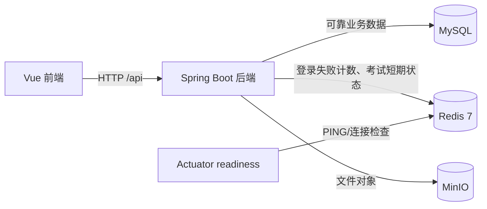
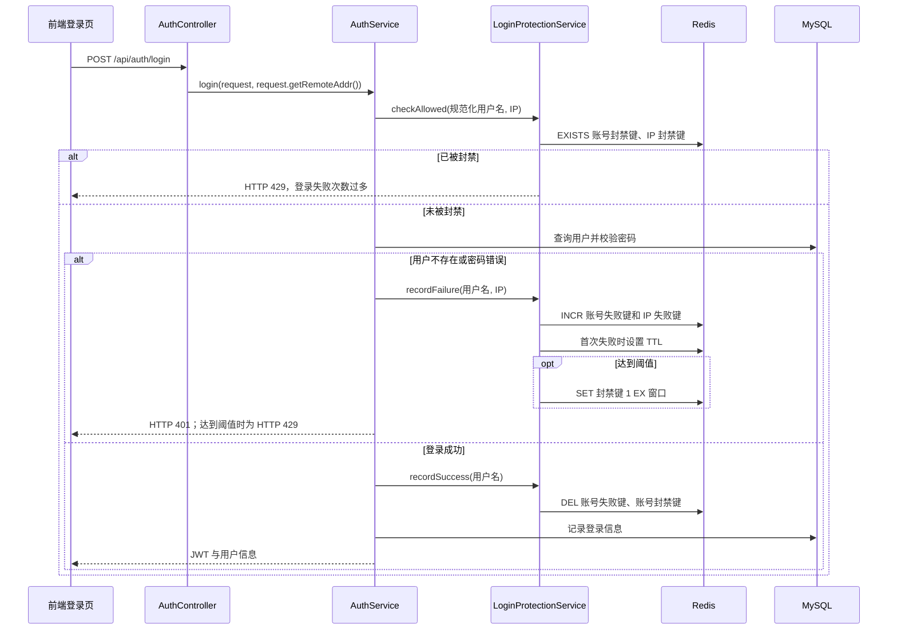
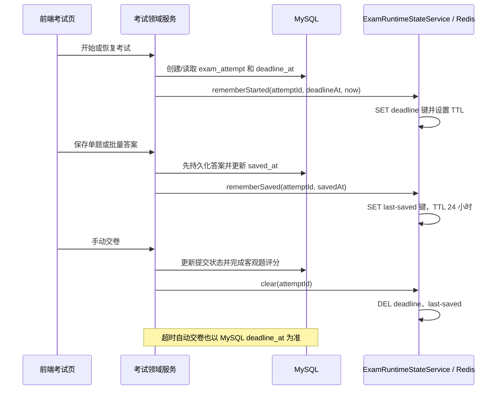

# Redis 使用说明

本文面向接手本项目的开发、测试和运维人员，依据当前仓库代码说明 Redis 的实际职责、调用链、键结构、过期策略、配置方式和排障方法。

> 结论先行：当前 Redis 只承担两类短期状态——**登录失败防刷**和**考试作答运行态缓存**。MySQL 始终保存可靠业务数据；Redis 故障时，这两处代码都采用“记录警告并继续业务”的降级策略。Redis 当前不保存 JWT 登录会话，也不承载通用 API 限流、AI 限流或 Spring Cache 业务对象缓存。

## 1. Redis 在系统架构中的位置



Redis 是后端内部基础设施，前端不会直接连接 Redis。所有读写均由 Spring Boot 通过 `StringRedisTemplate` 完成。

### 1.1 技术组件

| 组件 | 项目位置 | 作用 |
| --- | --- | --- |
| Spring Data Redis | `backend/pom.xml` | 提供 Redis 自动配置和 `StringRedisTemplate` |
| Lettuce 客户端 | 由 Spring Boot Redis Starter 默认引入 | 建立和维护 Redis 连接 |
| Spring Boot Actuator | `backend/pom.xml` | 提供 Redis 健康指示器 |
| Redis 连接参数 | `backend/src/main/resources/application.yml` | 配置主机、端口、密码、逻辑库和命令超时 |
| 本地 Redis 容器 | `infrastructure/docker-compose.local.yml` | 启动带密码和 AOF 持久化的 Redis 7.4 |

项目没有自行声明 `RedisConnectionFactory` 或序列化器。Spring Boot 根据 `spring.data.redis.*` 自动创建连接工厂和 `StringRedisTemplate`。因此当前 Redis 键和值都按字符串读写。

## 2. 当前使用位置总览

业务主源码中直接注入 `StringRedisTemplate` 的类只有两个：

| 业务场景 | Redis 操作类 | 上游调用位置 | Redis 数据是否为可靠数据源 |
| --- | --- | --- | --- |
| 登录失败防刷 | `backend/src/main/java/com/learningplatform/auth/security/LoginProtectionService.java` | `AuthService.login(...)` | 否；Redis 不可用时放行本次防刷检查 |
| 考试运行态缓存 | `backend/src/main/java/com/learningplatform/exam/service/ExamRuntimeStateService.java` | `CandidateExamSessionService`、`ExamAnswerService`、`ExamSubmissionService` | 否；考试截止时间、答案和提交状态以 MySQL 为准 |
| Redis 健康检查 | Spring Boot Actuator 自动配置 | `/actuator/health/readiness` | 仅反映依赖可用性 |

当前代码中没有 `@Cacheable`、`@CachePut`、`@CacheEvict`、Redis 消息订阅、分布式锁或 Redis Session。

## 3. 登录失败防刷

### 3.1 完整调用链



入口文件和职责如下：

1. `backend/src/main/java/com/learningplatform/auth/web/AuthController.java`
   - `POST /api/auth/login` 接收登录请求。
   - 通过 `HttpServletRequest.getRemoteAddr()` 获取本次连接的远端 IP。
2. `backend/src/main/java/com/learningplatform/auth/service/AuthService.java`
   - 将用户名去除首尾空白并转为小写。
   - 校验密码前调用 `checkAllowed(...)`。
   - 用户不存在或密码错误时调用 `recordFailure(...)`。
   - 登录成功时调用 `recordSuccess(...)`。
3. `backend/src/main/java/com/learningplatform/auth/security/LoginProtectionService.java`
   - 生成 Redis 键。
   - 计数、设置 TTL、建立封禁键以及清理账号状态。
4. `backend/src/main/java/com/learningplatform/common/config/LoginProtectionProperties.java`
   - 映射 `app.security.login-protection` 配置。

### 3.2 Redis 键结构

所有登录防刷键均使用前缀：

```text
auth:login:
```

用户名和 IP 不直接出现在键中，而是先进行 SHA-256，再编码为 64 位十六进制字符串。这样可以避免管理员在扫描 Redis 键时直接看到用户名或 IP。

| 键模板 | 值 | TTL | 含义 |
| --- | --- | --- | --- |
| `auth:login:failure:account:{sha256(username)}` | 失败次数，如 `3` | 防刷窗口 | 指定账号在当前窗口中的失败次数 |
| `auth:login:block:account:{sha256(username)}` | `1` | 防刷窗口 | 指定账号已达到失败阈值 |
| `auth:login:failure:ip:{sha256(ip)}` | 失败次数，如 `8` | 防刷窗口 | 指定 IP 在当前窗口中的失败次数 |
| `auth:login:block:ip:{sha256(ip)}` | `1` | 防刷窗口 | 指定 IP 已达到失败阈值 |

默认配置为：

- 单账号最多失败 `5` 次；
- 单 IP 最多失败 `20` 次；
- 统计和封禁窗口均为 `15` 分钟。

计数通过 Redis `INCR` 完成，单次自增是原子操作。某个失败计数第一次变为 `1` 时，代码再为其设置窗口 TTL；达到阈值后，创建值为 `1` 且具有同一窗口 TTL 的封禁键。

### 3.3 成功登录后的清理范围

登录成功只删除当前账号的两个键：

```text
auth:login:failure:account:{hash}
auth:login:block:account:{hash}
```

IP 失败计数和 IP 封禁键不会因某个账号成功登录而清除，而是等待 TTL 自动到期。这是为了防止攻击者通过一次成功登录重置同一来源 IP 对多个账号的失败累计。

### 3.4 Redis 故障时的行为

`checkAllowed`、`recordFailure` 和 `recordSuccess` 都捕获 `DataAccessException`：

- 后端记录 `WARN` 日志；
- 不把 Redis 异常返回给浏览器；
- 登录主流程继续执行。

这是一种 **fail-open（故障开放）** 策略：Redis 故障不会导致所有用户无法登录，但故障期间登录防刷能力会减弱。因此生产监控仍需及时告警。

相关日志包括：

```text
Redis unavailable while checking login protection; allowing this attempt
Redis unavailable while recording a failed login attempt
Redis unavailable while clearing login protection state
```

### 3.5 反向代理下的 IP 注意事项

当前登录防刷使用 `request.getRemoteAddr()`。若生产环境由 Nginx 反向代理，后端看到的地址可能是代理地址，而不是真实客户端地址。不能直接无条件信任浏览器提供的 `X-Forwarded-For`，否则攻击者可伪造 IP。

生产扩展时应同时完成：

1. 只信任受控反向代理；
2. 在 Spring/Tomcat 中正确启用转发头处理；
3. 由 Nginx 覆盖而非简单追加可信客户端 IP；
4. 验证登录防刷键是否按真实客户端拆分。

## 4. 考试作答运行态缓存

### 4.1 设计边界

`ExamRuntimeStateService` 只保存便于快速观察或后续扩展的短期运行态：

- 某次作答的截止时间；
- 某次作答最近一次保存时间。

当前代码只写入和删除这些键，**没有从 Redis 读取它们来决定是否允许答题、是否超时或恢复答案**。可靠数据都在 MySQL：

- `exam_attempt.deadline_at` 是截止时间的可靠来源；
- 题目答案及最近保存时间写入 MySQL；
- 作答状态和交卷结果写入 MySQL；
- `ExamTimeoutScheduler` 基于 MySQL 扫描过期作答并自动交卷。

因此 Redis 丢失、重启或被清空不会造成答卷丢失，也不会改变最终交卷结果。

### 4.2 完整调用链



### 4.3 写入位置

| 业务动作 | 上游类与方法 | Redis 方法 | 先写 MySQL 还是 Redis |
| --- | --- | --- | --- |
| 首次开始考试 | `CandidateExamSessionService.start(...)`，最终进入 `startResponse(...)` | `rememberStarted(...)` | 先创建 MySQL 作答记录 |
| 恢复考试 | `CandidateExamSessionService.resume(...)`，最终进入 `startResponse(...)` | `rememberStarted(...)` | 先读取并校验 MySQL 作答记录 |
| 保存单题答案 | `ExamAnswerService.save(...)` | `rememberSaved(...)` | 先保存答案并更新 MySQL `saved_at` |
| 批量保存答案 | `ExamAnswerService.saveBatch(...)` | `rememberSaved(...)` | 先保存全部答案并更新 MySQL `saved_at` |
| 手动或超时交卷 | `ExamSubmissionService.complete(...)` | `clear(...)` | 先完成 MySQL 提交与评分状态变更 |

### 4.4 Redis 键结构与 TTL

所有考试运行态键使用前缀：

```text
exam:attempt:
```

| 键模板 | 值示例 | TTL | 含义 |
| --- | --- | --- | --- |
| `exam:attempt:{attemptId}:deadline` | `2026-07-27T15:30:00` | `deadlineAt - now + 1 小时` | 作答截止时间副本 |
| `exam:attempt:{attemptId}:last-saved` | `2026-07-27T14:42:18.123` | 固定 24 小时 | 最近一次成功保存答案的时间副本 |

截止时间键的 TTL 计算规则：

```text
TTL = deadlineAt - now + 1 小时
```

若计算结果小于或等于零，则使用 1 小时。这使已到截止时间附近的键仍保留一段排障缓冲时间。

交卷成功后会同时删除上述两个键。若删除失败，业务交卷仍已由 MySQL 完成；残留键会根据 TTL 自动清理。

Redis 写入不参与 MySQL 事务，两者之间不存在分布式事务。例如 Redis 写入完成后，若同一业务事务因后续异常回滚，短时间内可能留下没有对应有效业务状态的缓存键。当前实现不读取这些键作业务决策，因此这种残留不会改变考试结果，最终会被交卷清理或 TTL 清理。未来若开始读取考试缓存，必须先处理这一一致性边界。

### 4.5 Redis 故障时的行为

`rememberStarted`、`rememberSaved` 和 `clear` 都捕获 `DataAccessException`，记录警告后返回：

```text
Redis unavailable while caching exam deadline for attempt {id}
Redis unavailable while caching exam save state for attempt {id}
Redis unavailable while clearing exam state for attempt {id}
```

因此：

- 开始/恢复考试仍可成功；
- 答案仍会保存到 MySQL；
- 手动或超时交卷仍可完成；
- Redis 恢复后，旧作答键不会自动从 MySQL 全量重建，后续恢复考试或再次保存时会重新写入相应键。

## 5. 健康检查中的 Redis

`application.yml` 将 Redis 加入 Actuator readiness 组：

```yaml
management:
  endpoint:
    health:
      group:
        readiness:
          include: readinessState,db,redis,minio
```

访问：

```text
GET /actuator/health/readiness
```

Spring Boot Actuator 的 Redis 健康指示器会使用自动配置的 Redis 连接执行检查。Redis 不可用时，readiness 会返回 `DOWN`。

需要区分两个健康接口：

| 接口 | 是否检查 Redis | 用途 |
| --- | --- | --- |
| `/actuator/health/readiness` | 是 | 检查 MySQL、Redis、MinIO 等依赖是否就绪 |
| `/api/health` | 否 | 只表示 Spring Boot 应用接口仍可响应，供前端显示基础连接状态 |

由于业务代码对 Redis 采用降级策略，readiness 为 `DOWN` 不等于所有功能立即不可用，但表示登录防刷或考试运行态缓存已经降级，必须排查。

## 6. Redis 当前没有承担的功能

理解“没有使用 Redis 的位置”同样重要：

| 功能 | 当前实现 | Redis 是否参与 |
| --- | --- | --- |
| JWT 登录状态 | JWT 由后端签发，前端保存并随请求发送；后端解析签名和有效期 | 否 |
| 用户资料、角色和权限 | MySQL + Spring Security | 否 |
| 通用 API 固定窗口限流 | `ApiRateLimitFilter` 内的 `ConcurrentHashMap` | 否 |
| AI 请求频率和单用户并发 | `AiRequestGuard` 内的 `ConcurrentHashMap`、队列和 `Semaphore` | 否 |
| 学习资料、学习进度、点赞、收藏、评论 | MySQL | 否 |
| 考试答案、截止时间、交卷和评分的可靠状态 | MySQL；Redis 只有副本 | 不作为可靠来源 |
| 文件、封面、头像 | MinIO，元数据在 MySQL | 否 |
| Spring Cache 注解缓存 | 当前没有启用 `@Cacheable` 等注解 | 否 |
| 分布式 Session、消息队列、发布订阅、分布式锁 | 当前没有实现 | 否 |

特别注意：`API_RATE_LIMIT_*` 和 `AI_*` 限流配置虽然也是“限流”，但当前都是单实例内存实现。应用重启会清空计数，多实例之间也不会共享。若未来部署多个后端实例，应考虑迁移到 Redis 或 API 网关。

## 7. 配置说明

### 7.1 连接配置

`backend/src/main/resources/application.yml`：

```yaml
spring:
  data:
    redis:
      host: ${REDIS_HOST:localhost}
      port: ${REDIS_PORT:6379}
      password: ${REDIS_PASSWORD:}
      database: ${REDIS_DATABASE:0}
      timeout: 3s
```

| 环境变量 | 默认值 | 说明 |
| --- | --- | --- |
| `REDIS_HOST` | `localhost` | Redis 主机名或地址 |
| `REDIS_PORT` | `6379` | Redis 服务端口 |
| `REDIS_PASSWORD` | 空 | Redis 密码；本地和生产必须设置强密码 |
| `REDIS_DATABASE` | `0` | Redis 逻辑数据库编号 |

`timeout: 3s` 是 Redis 操作超时。不要把真实密码写入被 Git 跟踪的文件。

### 7.2 登录防刷配置

| 环境变量 | 默认值 | 说明 |
| --- | --- | --- |
| `LOGIN_PROTECTION_ENABLED` | `true` | 是否启用 Redis 登录防刷 |
| `LOGIN_MAX_ACCOUNT_FAILURES` | `5` | 单账号窗口内最大失败次数 |
| `LOGIN_MAX_IP_FAILURES` | `20` | 单 IP 窗口内最大失败次数 |
| `LOGIN_PROTECTION_WINDOW_MINUTES` | `15` | 计数与封禁窗口，单位分钟 |

只有在受控的本地调试中才应临时关闭登录防刷。

### 7.3 考试缓存配置

| 环境变量 | 默认值 | 说明 |
| --- | --- | --- |
| `EXAM_RUNTIME_CACHE_ENABLED` | `true` | 是否写入考试运行态 Redis 键 |

将其设为 `false` 后，考试仍以 MySQL 正常运行，只是不再写入和删除上述两个考试键。

### 7.4 测试环境

`backend/src/test/resources/application-test.yml` 中：

```yaml
app:
  exam:
    runtime-cache-enabled: false
  security:
    login-protection:
      enabled: false
```

大部分集成测试不依赖真实 Redis。登录防刷逻辑由
`backend/src/test/java/com/learningplatform/auth/security/LoginProtectionServiceTests.java`
使用 Mockito 单独验证，包括：

- 功能关闭时不访问 Redis；
- 已封禁时返回 `TOO_MANY_REQUESTS`；
- 达到账号阈值时创建封禁键；
- 登录成功只清理账号状态；
- Redis 不可用时故障开放。

## 8. 本地启动与停止

### 8.1 准备环境变量

在项目根目录执行：

```powershell
Copy-Item -LiteralPath 'infrastructure/.env.example' `
  -Destination 'infrastructure/.env'
```

编辑 `infrastructure/.env`，为 `REDIS_PASSWORD` 设置强密码。该文件不应提交到 Git。

### 8.2 启动 Redis

```powershell
docker compose --env-file infrastructure/.env `
  -f infrastructure/docker-compose.local.yml up -d redis

docker compose --env-file infrastructure/.env `
  -f infrastructure/docker-compose.local.yml ps
```

本地容器具有以下特征：

- 镜像：`redis:7.4-alpine`；
- 宿主端口只绑定 `127.0.0.1:6379`；
- 通过 `requirepass` 启用密码；
- 通过 `appendonly yes` 启用 AOF；
- 数据保存到 Docker 卷 `learning-platform-redis-data`；
- 容器自带 `PING` 健康检查。

### 8.3 验证连接

```powershell
docker compose --env-file infrastructure/.env `
  -f infrastructure/docker-compose.local.yml exec redis `
  sh -c 'redis-cli -a "$REDIS_PASSWORD" ping'
```

预期输出：

```text
PONG
```

### 8.4 停止和恢复

```powershell
docker compose --env-file infrastructure/.env `
  -f infrastructure/docker-compose.local.yml stop redis

docker compose --env-file infrastructure/.env `
  -f infrastructure/docker-compose.local.yml start redis
```

不要随意执行带 `-v` 的 `docker compose down`，否则会删除 Redis 数据卷。

## 9. 查看和验证 Redis 数据

进入 Redis CLI：

```powershell
docker compose --env-file infrastructure/.env `
  -f infrastructure/docker-compose.local.yml exec redis `
  sh -c 'redis-cli -a "$REDIS_PASSWORD"'
```

常用只读命令：

```redis
SELECT 0
DBSIZE
SCAN 0 MATCH auth:login:* COUNT 100
SCAN 0 MATCH exam:attempt:* COUNT 100
TYPE exam:attempt:123:deadline
GET exam:attempt:123:deadline
TTL exam:attempt:123:deadline
GET exam:attempt:123:last-saved
TTL exam:attempt:123:last-saved
```

生产环境优先使用 `SCAN`，不要用 `KEYS *` 扫描大库，以免阻塞 Redis。

### 9.1 登录防刷验证

1. 使用同一账号连续输入错误密码。
2. 在达到默认第 5 次失败前后观察 HTTP 响应。
3. 使用 `SCAN 0 MATCH auth:login:* COUNT 100` 查看失败计数键和封禁键。
4. 对找到的键执行 `GET` 和 `TTL`。
5. 在窗口到期后确认键自动消失。

由于键中使用 SHA-256，无法仅根据扫描结果直接反推出用户名或 IP，这是预期行为。

### 9.2 考试运行态验证

1. 开始一场考试，找到 `exam:attempt:{id}:deadline`。
2. 保存一道题，确认出现 `exam:attempt:{id}:last-saved`。
3. 检查两个键的值和 TTL。
4. 交卷后再次扫描，确认两个键已删除。
5. 暂停 Redis 后重复保存操作，确认 MySQL 答案仍可保存且后端只记录警告。

## 10. 常见故障排查

### 10.1 readiness 返回 DOWN

按以下顺序检查：

```powershell
docker compose --env-file infrastructure/.env `
  -f infrastructure/docker-compose.local.yml ps redis

docker compose --env-file infrastructure/.env `
  -f infrastructure/docker-compose.local.yml logs --tail 100 redis

Get-NetTCPConnection -LocalPort 6379 -ErrorAction SilentlyContinue
```

然后核对后端运行配置中的 `REDIS_HOST`、`REDIS_PORT`、`REDIS_PASSWORD` 和 `REDIS_DATABASE`。

### 10.2 后端提示认证失败

典型原因：

- `infrastructure/.env` 与 IDEA 后端运行配置中的密码不一致；
- 修改容器密码后只重启后端，没有按新配置重建 Redis 容器；
- 后端连接了另一个 Redis 实例。

不要在日志、截图、聊天或提交记录中公开真实密码。

### 10.3 登录一直返回 429

1. 确认是否确实达到账号或 IP 阈值；
2. 查看相关键的 TTL，正常情况下会自动过期；
3. 检查反向代理是否导致所有用户都以同一个 IP 计数；
4. 不要直接在生产环境删除全部 Redis 数据。

确需人工解除时，应先确认精确键和事故范围，只删除目标账号或 IP 的 failure/block 键。

### 10.4 Redis 不可用但前端仍显示“后端连接正常”

这是因为首页使用的 `/api/health` 不检查外部依赖。应以
`/actuator/health/readiness` 和后端告警日志判断 Redis 是否可用。

### 10.5 考试 Redis 键丢失

考试 Redis 键是非权威缓存，丢失后无需从备份恢复。应先检查 MySQL 中的
`exam_attempt` 和答案记录；考生恢复考试或再次保存答案时，会重新写入相应运行态键。

## 11. 数据安全与运维建议

- Redis 不应暴露到公网；本地 Compose 已限制为 `127.0.0.1`。
- 生产环境应使用安全组或防火墙只允许后端访问 Redis。
- 使用独立强密码，并通过环境变量或密钥管理系统注入。
- 不在业务日志中打印 Redis 密码、完整 JWT、身份证号或用户密码。
- 登录键虽对用户名和 IP 做了 SHA-256，但哈希值仍属于安全相关数据，不应公开。
- Redis AOF 和数据卷只能提高短期状态的恢复能力，不能替代 MySQL 备份。
- 监控连接数、内存、命中/写入量、过期键、拒绝连接和 Actuator readiness。
- 当前所有业务键都有 TTL 或会在业务完成时删除，不应新增无生命周期的临时键。

## 12. 后续扩展注意事项

若系统改为多实例部署，可以考虑将以下单机内存状态迁移到 Redis：

1. `ApiRateLimitFilter` 的通用接口限流；
2. `AiRequestGuard` 的 AI 请求窗口和单用户并发控制；
3. 需要跨实例协调的短期幂等键或分布式锁。

扩展时应遵循：

- 明确 MySQL 与 Redis 谁是可靠数据源；
- 统一键前缀，例如 `{domain}:{entity}:{id}:{purpose}`；
- 所有临时键必须设置 TTL；
- 多键一致性操作使用 Lua 脚本或事务，避免 `INCR` 与 `EXPIRE` 之间出现中断窗口；
- 设计缓存穿透、击穿、雪崩和 Redis 故障时的降级行为；
- 增加集成测试，不只依赖 Mock；
- 更新本文档中的键清单、TTL、调用链和运维命令。

## 13. 关键源码索引

| 文件 | 与 Redis 的关系 |
| --- | --- |
| `backend/pom.xml` | 引入 Spring Data Redis 与 Actuator |
| `backend/src/main/resources/application.yml` | Redis 连接、readiness、登录防刷和考试缓存配置 |
| `backend/.env.example` | Redis 和两类业务开关的环境变量模板 |
| `backend/src/main/java/com/learningplatform/LearningPlatformApplication.java` | 启用配置属性扫描 |
| `backend/src/main/java/com/learningplatform/common/config/LoginProtectionProperties.java` | 登录防刷类型安全配置 |
| `backend/src/main/java/com/learningplatform/auth/security/LoginProtectionService.java` | 登录失败计数与封禁的全部 Redis 操作 |
| `backend/src/main/java/com/learningplatform/auth/service/AuthService.java` | 登录防刷业务调用入口 |
| `backend/src/main/java/com/learningplatform/auth/web/AuthController.java` | 登录 HTTP 入口和远端 IP 来源 |
| `backend/src/main/java/com/learningplatform/exam/service/ExamRuntimeStateService.java` | 考试运行态 Redis 写入与清理 |
| `backend/src/main/java/com/learningplatform/exam/service/CandidateExamSessionService.java` | 开始/恢复考试时缓存截止时间 |
| `backend/src/main/java/com/learningplatform/exam/service/ExamAnswerService.java` | 保存答案后缓存最近保存时间 |
| `backend/src/main/java/com/learningplatform/exam/service/ExamSubmissionService.java` | 交卷后清理考试缓存 |
| `backend/src/main/java/com/learningplatform/exam/service/ExamTimeoutScheduler.java` | 证明自动交卷以 MySQL 过期作答为依据 |
| `backend/src/main/java/com/learningplatform/common/web/ApiRateLimitFilter.java` | 当前为内存限流，不使用 Redis |
| `backend/src/main/java/com/learningplatform/ai/service/AiRequestGuard.java` | 当前为内存 AI 守卫，不使用 Redis |
| `backend/src/test/java/com/learningplatform/auth/security/LoginProtectionServiceTests.java` | 登录防刷 Redis 单元测试 |
| `backend/src/test/resources/application-test.yml` | 测试环境关闭真实 Redis 业务依赖 |
| `infrastructure/docker-compose.local.yml` | 本地 Redis 容器、密码、AOF、端口和数据卷 |
| `infrastructure/README.md` | 本地 Redis 与 MinIO 启停说明 |
