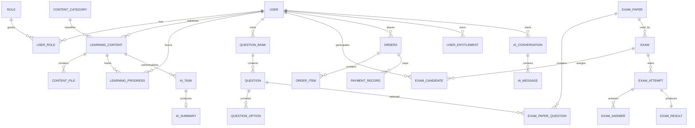

# 智能在线学习考试平台数据库设计

## 1. 设计目标

数据库使用 MySQL 8，覆盖用户、学习资料、在线考试、AI、订单权益和后台管理六个领域。MVP 使用单库，所有金额使用 `DECIMAL`，所有业务主键使用无符号 `BIGINT`，时间精度统一到毫秒。

核心约定：

- 字符集：`utf8mb4`，排序规则：`utf8mb4_0900_ai_ci`。
- 表名、字段名：小写下划线命名。
- 主键：`id BIGINT UNSIGNED AUTO_INCREMENT`。
- 通用时间：`created_at`、`updated_at`。
- 需要保留历史的主数据使用 `deleted` 逻辑删除；关系表取消关系时直接删除关系记录。
- 状态和类型使用可读的英文代码，不使用 MySQL `ENUM`，避免后续增加状态必须修改字段定义。
- 强关系使用外键保证完整性；审计人等弱关系只保留 ID，避免阻碍历史数据保留。
- JSON 只用于不同题型答案、AI 结构化结果等形态差异明显的数据，常用查询字段仍单独建列。
- MinIO 对象名最长且使用 `utf8mb4`，不能直接加入完整联合索引；`content_file` 使用自动生成的 SHA-256 二进制列建立唯一约束，同时保留完整对象名。

## 2. 表清单

| 领域 | 表 | 用途 |
| --- | --- | --- |
| 用户 | `user` | 用户账号及个人资料 |
| 用户 | `role` | 普通用户、发布者、管理员角色 |
| 用户 | `user_role` | 用户与角色关系 |
| 学习 | `content_category` | 学习资料分类，支持一级/二级结构 |
| 学习 | `learning_content` | 学习资料主信息和发布状态 |
| 学习 | `content_file` | 封面、正文文档、视频和附件对象 |
| 学习 | `learning_progress` | 用户学习进度 |
| 学习 | `content_comment` | 资料评论 |
| 学习 | `content_like` | 点赞关系 |
| 学习 | `content_favorite` | 收藏关系 |
| 题库 | `question_bank` | 发布者题库 |
| 题库 | `question` | 五类题目主信息 |
| 题库 | `question_option` | 单选、多选和判断题选项 |
| 考试 | `exam_paper` | 固定试卷 |
| 考试 | `exam_paper_question` | 试卷题目、顺序和分值 |
| 考试 | `exam` | 已发布考试及规则 |
| 考试 | `exam_candidate` | 指定考生及参与状态 |
| 考试 | `exam_attempt` | 一次考试作答会话 |
| 考试 | `exam_answer` | 每道题的考生答案和评分 |
| 考试 | `exam_result` | 最终成绩快照 |
| AI | `ai_task` | AI 调用任务和处理状态 |
| AI | `ai_summary` | 资料总结结果 |
| AI | `ai_conversation` | 围绕资料的讲解会话 |
| AI | `ai_message` | AI 会话消息 |
| AI | `ai_usage_record` | AI 额度扣减和调用审计 |
| 订单 | `product` | 资料、AI 次数包、考试次数包商品 |
| 订单 | `orders` | 订单主表 |
| 订单 | `order_item` | 下单时的商品快照 |
| 订单 | `payment_record` | 模拟/真实支付流水 |
| 权益 | `user_entitlement` | 资料访问权和次数额度 |
| 系统 | `content_audit` | 资料审核记录 |
| 系统 | `operation_log` | 关键操作日志 |
| 系统 | `system_config` | 非敏感系统配置 |

## 3. 主要关系

## 4. 关键状态代码

### 用户

- `user.status`：`ACTIVE`、`DISABLED`、`LOCKED`。
- `role.code`：`USER`、`PUBLISHER`、`ADMIN`。

### 学习资料

- `learning_content.status`：`DRAFT`、`PENDING_REVIEW`、`PUBLISHED`、`REJECTED`、`OFFLINE`。
- `learning_content.content_type`：`ARTICLE`、`DOCUMENT`、`VIDEO`、`ATTACHMENT`、`MIXED`。
- `content_file.file_role`：`COVER`、`CONTENT`、`VIDEO`、`ATTACHMENT`、`SUBTITLE`。

### 题目与考试

- `question.question_type`：`SINGLE_CHOICE`、`MULTIPLE_CHOICE`、`TRUE_FALSE`、`FILL_BLANK`、`SHORT_ANSWER`。
- `question.answer_json` 统一保存 `{"acceptedAnswers":[["答案或可接受写法"]]}`：外层按答案位置排序，内层保存该位置允许的写法；选择题答案使用选项代码，判断题使用 `TRUE/FALSE`，完整约定见 `backend/docs/question-answer-format.md`。
- 发布者管理接口可返回答案与解析；考生接口只能使用不含答案、解析和选项正确标记的安全响应模型。
- `exam_paper.status`：`DRAFT`、`READY`、`ARCHIVED`。
- `exam.status`：`DRAFT`、`PUBLISHED`、`ONGOING`、`FINISHED`、`CANCELLED`。
- `exam_attempt.status`：`IN_PROGRESS`、`SUBMITTED`、`AUTO_SUBMITTED`、`GRADING`、`GRADED`。
- `exam_answer.grading_status`：`UNANSWERED`、`PENDING`、`AUTO_GRADED`、`REVIEW_REQUIRED`、`MANUALLY_GRADED`。

### AI

- `ai_task.task_type`：`SUMMARY`、`EXPLANATION`。
- `ai_task.status`：`PENDING`、`PROCESSING`、`SUCCEEDED`、`FAILED`、`CANCELLED`。
- `ai_usage_record.status`：`RESERVED`、`CONSUMED`、`RELEASED`、`FAILED`。

### 订单与权益

- `product.product_type`：`CONTENT`、`AI_PACKAGE`、`EXAM_PACKAGE`。
- `orders.status`：`PENDING_PAYMENT`、`PAID`、`CANCELLED`、`CLOSED`、`REFUNDED`。
- `payment_record.status`：`PENDING`、`SUCCESS`、`FAILED`、`CLOSED`、`REFUNDED`。
- `user_entitlement.entitlement_type`：`CONTENT_ACCESS`、`AI_QUOTA`、`EXAM_QUOTA`。
- `user_entitlement.status`：`ACTIVE`、`EXHAUSTED`、`EXPIRED`、`REVOKED`。

## 5. 一致性与并发策略

1. 支付成功、权益发放和订单状态变更必须在同一事务内完成，并以订单号/支付业务号保证幂等。
2. `user_entitlement.version` 用于乐观锁；扣额度同时检查 `available_quantity > 0`。考试发布先锁定考试记录，再通过 `ExamPublishQuotaService` 扣减一条有效的 `EXAM_QUOTA`；发布状态与额度扣减处于同一事务，重复发布不重复扣减。
3. `exam_attempt.version` 用于交卷竞争控制；手动交卷和超时交卷只能有一个成功。
4. `exam_answer` 通过 `(attempt_id, question_id)` 唯一约束实现答案幂等保存。
5. `content_like`、`content_favorite` 通过用户与资料联合唯一约束避免重复操作。
6. 试卷题目和订单项保留必要快照，避免原始题目或商品修改影响历史数据。

## 6. 脚本文件

- `database/001_schema.sql`：创建全部表、索引和外键，不删除已有数据库或表。
- `database/002_seed_data.sql`：初始化角色、次数包商品和非敏感系统配置，可重复执行。
- `database/README.md`：数据库创建、执行顺序、检查语句和管理员初始化方案。
