# 智能在线学习考试平台——项目设计报告图表代码

本文件按项目设计报告中的图号顺序整理。项目页面效果图需要从实际运行系统中截图，因此不在本文件中生成。其余用例图、架构图、模块图、部署图、ER 图、类图和时序图均提供可编辑代码。

使用方式：

1. `plantuml` 代码可粘贴到 PlantUML、IDEA PlantUML 插件或兼容的在线渲染器中。
2. `mermaid` 代码可粘贴到 Mermaid Live Editor、支持 Mermaid 的 Markdown 编辑器或相关 IDE 插件中。
3. 导出图片时优先使用 SVG 或 2 倍分辨率 PNG，再插入 Word 中对应的红色占位位置。

---

## 图 2-1 系统总体用例图

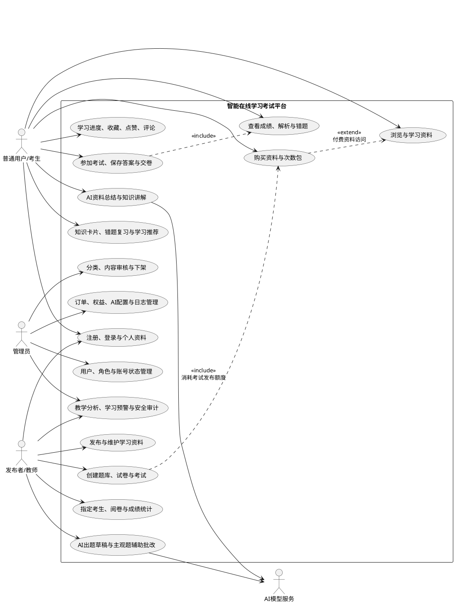

---

## 图 3-1 系统总体架构图

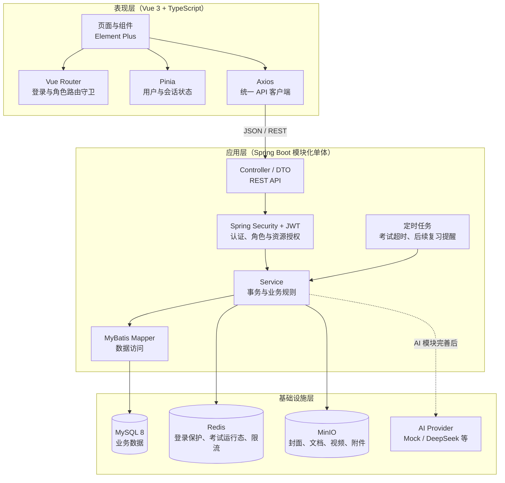

---

## 图 3-2 系统部署图

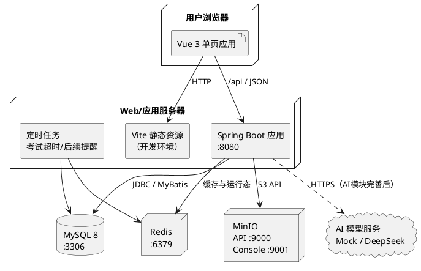

---

## 图 3-3 系统功能模块图

```mermaid
flowchart TB
    Root["智能在线学习考试平台"]

    Root --> Base["基础与用户"]
    Root --> Learning["学习与内容"]
    Root --> Exam["题库与考试"]
    Root --> Commerce["商品、订单与权益"]
    Root --> AI["AI 学习"]
    Root --> Admin["管理与安全"]
    Root --> Extend["创新扩展"]

    Base --> Auth["注册、登录、JWT、登录防刷"]
    Base --> Profile["个人资料、角色、账号状态"]

    Learning --> Content["图文/文档/视频/附件"]
    Learning --> Audit["草稿、送审、发布、驳回、下架"]
    Learning --> Progress["学习进度、记录、收藏、点赞、评论"]
    Learning --> Notes["时间点笔记、PDF批注、知识卡片"]

    Exam --> Bank["五类题目、题库、固定/随机组卷"]
    Exam --> Publish["考试配置、指定考生、发布额度"]
    Exam --> Answer["倒计时、保存、断线恢复、手动/超时交卷"]
    Exam --> Grade["自动评分、人工阅卷、成绩与统计"]
    Exam --> Integrity["切屏/设备/IP等轻量诚信记录"]

    Commerce --> Product["付费资料、AI次数包、考试次数包"]
    Commerce --> Order["订单、模拟/真实支付、幂等处理"]
    Commerce --> Entitlement["访问权与额度发放、原子扣减"]
    Commerce --> Promotion["会员、套餐、优惠券、促销、打赏"]

    AI --> Summary["资料摘要、知识点、复习提纲"]
    AI --> Tutor["基于资料的讲解、苏格拉底式辅导"]
    AI --> Generate["AI出题草稿、思维导图、知识卡片"]
    AI --> Review["主观题建议分与反馈"]

    Admin --> UserAdmin["用户、角色、禁用/启用"]
    Admin --> ContentAdmin["分类、审核、下架"]
    Admin --> SystemAdmin["考试、订单、AI配置、操作日志"]
    Admin --> Security["限流、上传校验、脱敏、安全响应头"]

    Extend --> Gamification["连胜、XP、等级、徽章、排行榜、挑战"]
    Extend --> Adaptive["错题本、间隔复习、知识图谱、自适应推荐"]
    Extend --> Social["学习圈、问答悬赏、动态与周报分享"]
    Extend --> Analytics["学生仪表盘、教师分析、学困预警"]
    Extend --> Creator["富文本、LaTeX、代码高亮、视频内嵌小测"]
```

---

## 图 3-4 MVP 核心数据库 ER 图

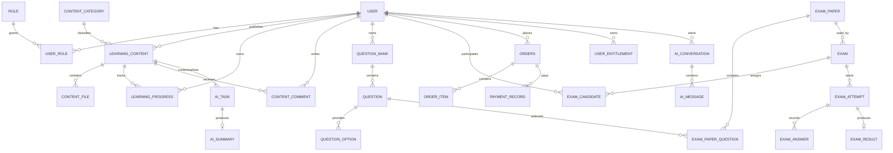

---

## 图 3-5 后续扩展数据库关系图

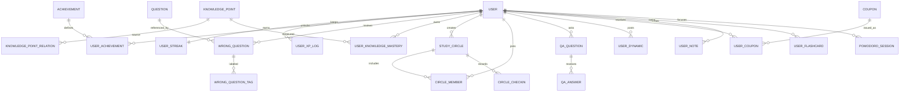

---

## 图 4-1 认证与授权模块类图

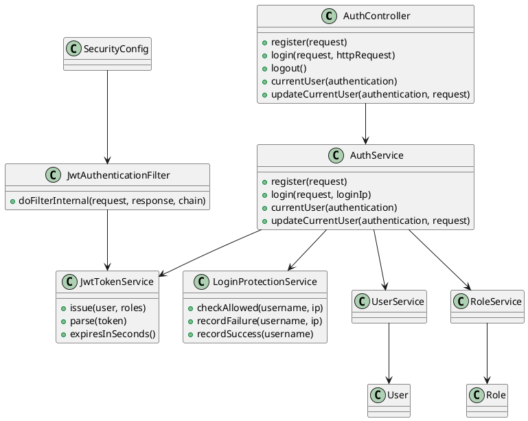

---

## 图 4-3 学习资料模块类图

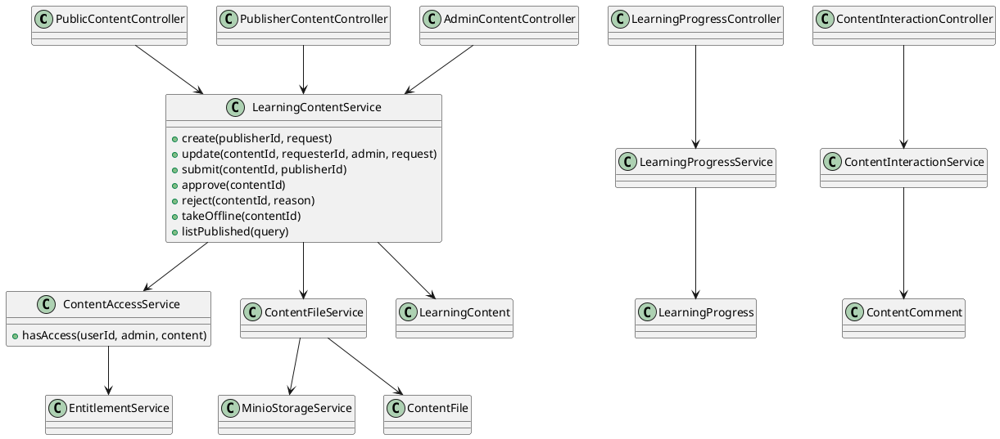

---

## 图 4-4 学习资料发布与审核时序图

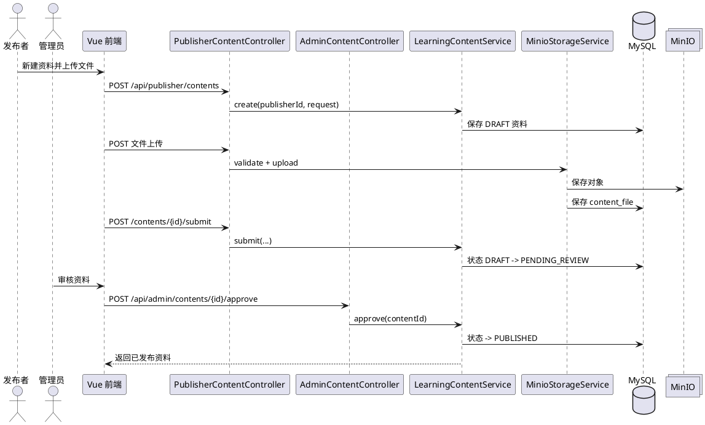

---

## 图 4-7 在线考试模块类图

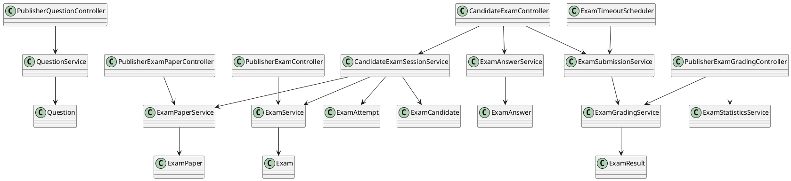

---

## 图 4-8 在线考试作答、交卷与评分时序图

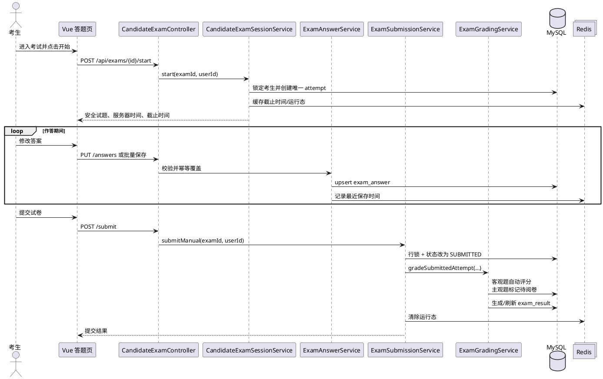

---

## 图 4-12 商品、订单与权益模块类图

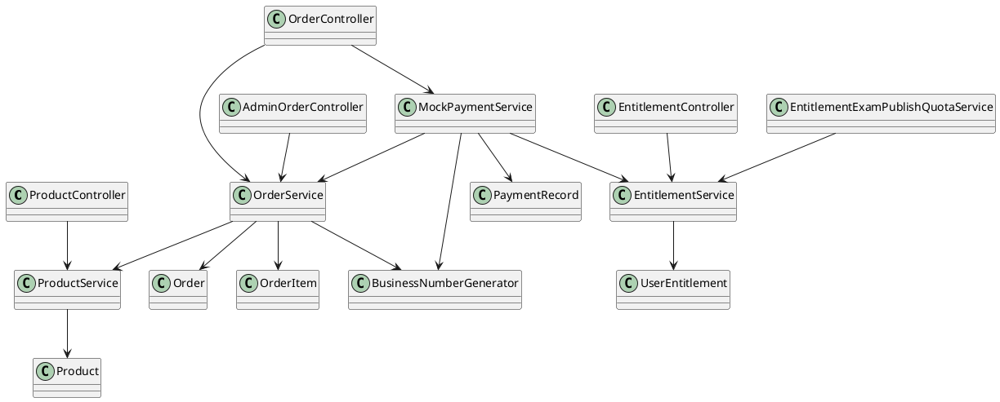

---

## 图 4-13 模拟支付与权益发放时序图

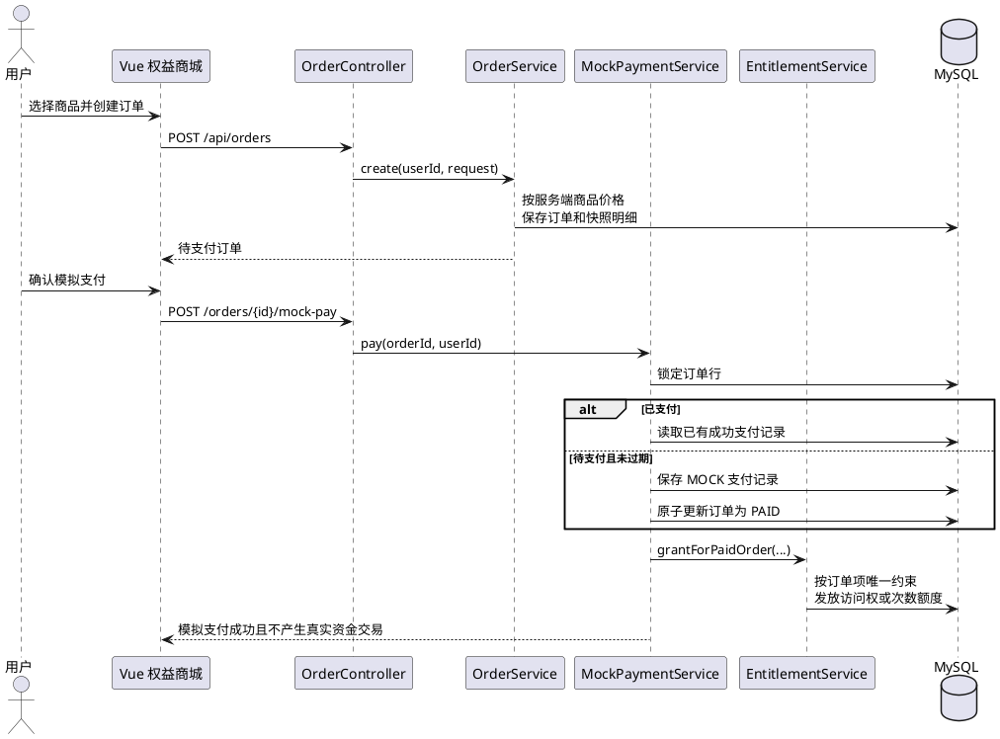

---

## 图 4-15 AI 学习模块规划类图

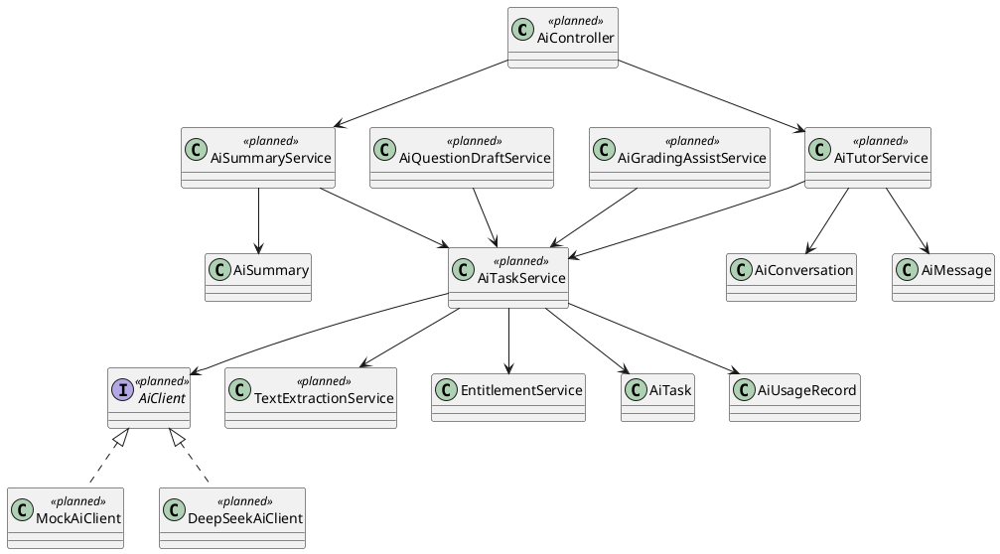

---

## 图 4-16 AI 资料总结与额度扣减规划时序图

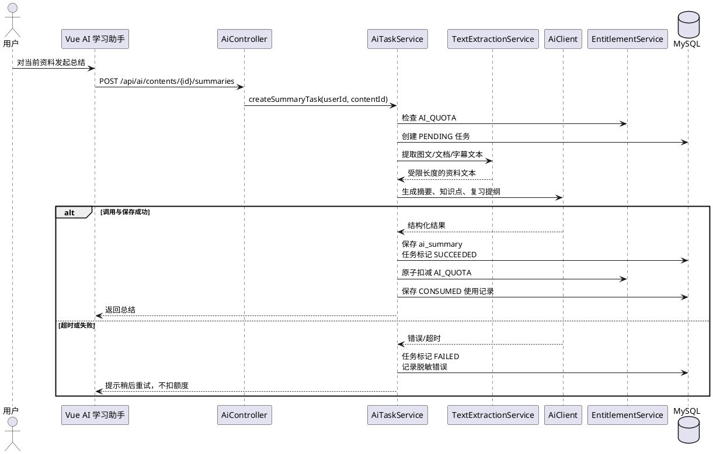

---

## 图 4-18 后续个性化学习闭环活动图

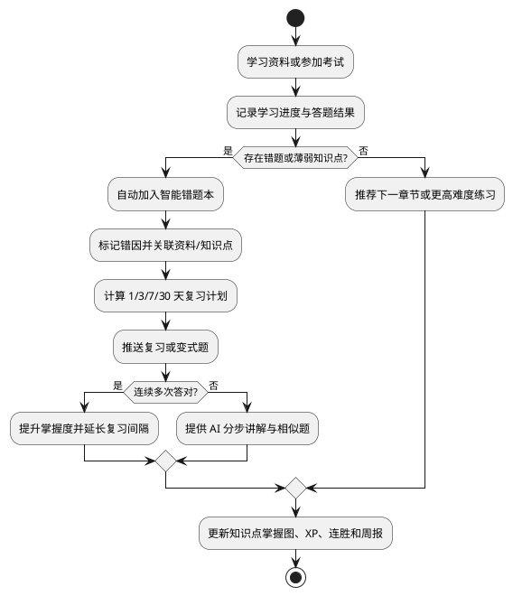
